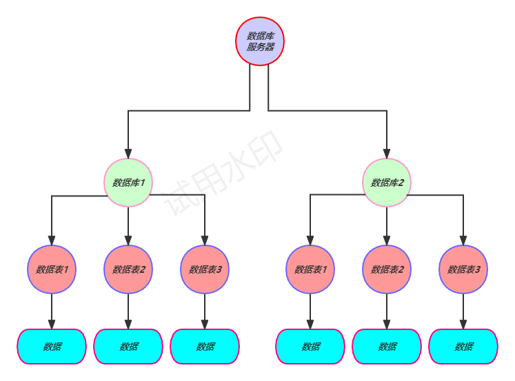
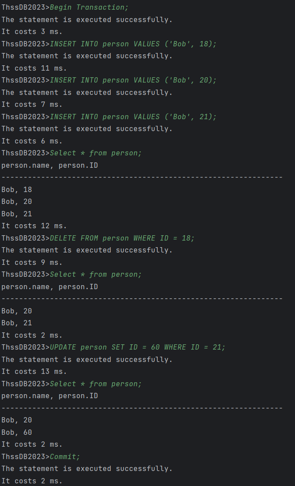

# 数据库用户手册

**目录**

- [前言](#前言)
- 元数据模块
    - [创建数据库](#创建数据库)
    - [使用切换数据库](#使用切换数据库)
    - [删除数据库](#删除数据库)
    - [创建数据表](#创建数据表)
    - [删除数据表](#删除数据表)
- 存储模块
    - [插入数据](#插入数据)
    - [删除数据](#删除数据)
    - [更新数据](#更新数据)
- 查询模块
    - [单表查询](#单表查询)
    - [多表连接查询](#多表连接查询)
- 事务模块
    - [事务](#事务)

---

### 前言

本数据库支持简单字符串/数值类型数据的保存、查看、修改、删除功能。

各数据库下有多个互相独立的数据表，各数据库互相独立。

其关系可总结为下图：



运行该数据库，则在其运行目录下创建一个`/data/`目录，并将所有用户相关数据存储在其中。

>请不要随意修改该目录！否则数据库提供的服务可能不完整，或甚至无法提供正常服务。

以下是功能使用说明，请注意：

- 任何关键字是**大小写不敏感**的。
- 任何用户指定名称不可与本使用文档中提示的关键字冲突。


---

### 创建数据库

```SQL
CREATE DATABASE DATABASE_NAME;
```

>示例：`CREATE DATABASE test_db;`

在使用本数据库的任何服务之前，请确保创建了使用的数据库。

>执行该语句请确保：
>- 输入的数据库名称在当前服务器中不存在。

---

### 使用（切换）数据库

```SQL
USE DATABASE_NAME;
```

>示例：`USE test_db;`

在创建新的数据库后，需要切换至该数据库（或者任何已创建完毕的数据库），才可以在该数据库下使用服务。

>执行该语句请确保：
>- 输入的数据库名称在当前服务器中存在——已完成创建。

可在各数据库中使用互相独立的**数据表(Table)** 。

---

### 删除数据库

```SQL
DROP DATABASE DATABASE_NAME;
```

>示例：`DROP DATABASE test_db;`

若不再使用某个已有数据库，可通过上述SQL语句进行删除操作。

>执行该语句请确保：
>- 输入的数据库名称在当前服务器中存在——已完成创建。

***注意：这个语句的执行将导致该数据库下的所有信息与数据的永久删除***。

>若删除的是当前使用的数据库，则需要重新切换至其他数据库才可以继续使用服务。

---

### 创建数据表

```SQL
CREATE TABLE TABLE_NAME(
    ATTR_NAME1 ATTR_TYPE1 [OPTION],
    ATTR_NAME2 ATTR_TYPE2
    ...,
    PRIMARY KEY (ATTR_NAME1)
)
```

>示例：`CREATE TABLE person (name STRING(256), id INT PRIMARY KEY);`，等价于：`CREATE TABLE person (name STRING(256), id INT, PRIMARY KEY(id));`

在当前使用的数据库下，创建数据表，数据表下保存相应格式的真实数据。

创建数据表时可指定多个数据表**属性(Attribute)** 。

属性类行`ATTR_TYPE`可选值有：

- `INT`：整数类型
- `LONG`：长整数类型
- `FLOAT`：单精度浮点数类型
- `DOUBLE`：双精度浮点数类型
- `STRING`：字符串类型
    - 特别地，字符串类型需要**最大长度**。
    - 示例：`ATTR_NAME1 STRING(256)`

每个属性的`[OPTION]`处可选：

- `PRIMARY KEY`：指定该属性为**主键属性(Primary Key)** 。
    - 仅支持唯一一个主键属性，不支持多个主键属性。
- `NOT NULL`：指定该属性**非空(Not NULL)** 。
    - 主键属性默认为非空。
- 或者什么都不填。


若未在上述`[OPTION]`处指定主键，则需要在括号内的末尾指定主键：

主键是**数据存储、查询、修改**的重要依据，请谨慎指定并使用。

>执行该语句请确保：
>- 已切换至有效数据库。
>- 输入的数据表名称在当前使用的数据库下不存在。
>- 严格遵循上述语法定义。
>    - 主键定义等

---

### 删除数据表

```SQL
DROP TABLE TABLE_NAME
```

>示例：`DROP TABLE person;`

同数据库，不再使用的数据表可通过上述SQL语句进行删除操作。

>执行该语句请确保：
>- 已切换至有效数据库。
>- 删除的数据表是**当前使用的数据库下的**。
>- 输入的数据库表存在。

***注意：这个语句的执行将导致该数据库下的所有信息与数据的永久删除***。

---

### 查看数据表

```SQL
SHOW TABLE TABLE_NAME
```

>示例：`SHOW TABLE person;`

对于已创建的数据表，可通过上述SQL语句查看其数据表结构定义。

用每行格式如下的表展示表结构信息，各行代表数据表的一个属性：

```
| ATTR_NAME | ATTR_TYPE | PRIMARY_KEY | NOT_NULL | MAX_LENGTH |
```

- `ATTR_NAME`：属性名称
- `ATTR_NAME`：属性类型
    - 支持的五种类型请参阅《创建数据表》部分
- `PRIMARY_KEY`：是否为主键
    - 0 - 非主键 / 1 - 主键
- `NOT_NULL`：是否指定非空
    - 0 - 可空 / 1 - 非空
- `MAX_LENGTH`：属性值最大长度
    - 仅`STRING`字符串类型有效，其他类型显示为0

>执行该语句请确保：
>- 已切换至有效数据库。
>- 输入的数据库表存在且属于当前使用的数据库。

---

### 插入数据

```SQL
INSERT INTO TABLE_NAME[(ATTR_NAME1, ATTR_NAME2, ...)] 
    VALUES (ATTR_VALUE1, ATTR_VALUE2, ...);
```

>示例：`INSERT INTO person VALUES ('PCB', 1);`，等价于：`INSERT INTO person(id, name) VALUES (1, 'PCB');`

指定某个数据表，可通过上述SQL语句向该表插入新的数据。

可在数据表名称之后的选项处`[(ATTR_NAME1, ATTR_NAME2, ...)]`指定`VALUES`属性值列表中的列顺序，无该选项则默认**属性值列表中的顺序与创建数据表时的定义一致**。

例如，创建数据表`person`时的属性定义顺序为：`name`, `id`，则插入时的顺序也应一致：先输入`name`，再输入`id`。

>用上述方法指定属性值列表顺序时，应完整填写所有数据表下的属性名，顺序可乱，但**缺一不可**。

另有注意事项：

- `STRING`字符串类型变量需用**单引号**括起来。
- 数值类型数据**不支持负数**。
- 主键值**不可为空**。

>执行该语句请确保：
>- 已切换至有效数据库。
>- 输入的数据库表存在且属于当前使用的数据库。
>- 输入数据的主键在该数据表中不存在。
>- 严格遵循上述语法定义。

---

### 删除数据

```SQL
DELETE FROM TABLE_NAME WHERE ATTR_NAME = ATTRVALUE;
```

>示例：`DELETE FROM person WHERE id=1;`

指定某个数据表，可通过上述SQL语句从该表中**删除所有满足`WHERE`条件的数据**。

`ATTR_NAME`为过滤删除目标数据使用的属性名，删除目标为`ATTR_NAME`下的值等于`ATTR_VALUE`的数据行。

>执行该语句请确保：
>- 已切换至有效数据库。
>- 输入的数据库表存在且属于当前使用的数据库。
>- 严格遵循上述语法定义。
>    - `ATTR_NAME`须为该数据表下的属性

---

### 更新数据

```SQL
UPDATE TABLE_NAME SET SET_ATTR_NAME=SET_ATTR_VALUE WHERE WHERE_ATTR_NAME=WHERE_ATTR_VALUE;
```

>示例：`UPDATE person SET name='thu' WHERE id=1;`

指定某个数据表，可通过上述SQL语句从该表中选择**满足`WHERE`条件的数据，并更新其某一属性下的值**。

`WHERE_ATTR_NAME`为过滤更新目标数据使用的属性名，更新目标为`WHERE_ATTR_NAME`下的值等于`WHERE_ATTR_VALUE`的数据行。

找到目标数据后，将该数据的`SET_ATTR_NAME`属性下的值更新为`SET_ATTR_VALUE`。

请注意：`WHERE_ATTR_NAME`只支持该数据表的**主键**，并且`SET_ATTR_NAME`为主键时，`SET_ATTR_VALUE`的主键值应在该数据表中**不存在**。

>执行该语句请确保：
>- 已切换至有效数据库。
>- 输入的数据库表存在且属于当前使用的数据库。
>- 严格遵循上述语法定义。
>    - `WHERE`条件只能在主键范围内。
>    - `SET`目标为主键时，应保持完整性。

---

### 单表查询

单表查询语句的通用结构如下：
```SQL
SELECT (DISTINCT) ATTR_NAME1, ATTR_NAME2, ..., ATTR_NAMEN 
FROM TABLE_NAME 
WHERE ATTR_NAME_K COMPARATOR ATTR_VALUE_K;
```

具体地：
- 各个ATTR_NAME为要查询的属性名称，也可用SELECT * 查询表中符合条件的记录的所有属性。
- 本数据库支持DISTINCT关键字，可在查询时对返回的属性集进行去重。
- TABLE_NAME为要查询的单表名称
- WHERE语句中的"ATTR_NAME_K COMPARATOR ATTR_VALUE_K"为查询的限定条件，其中COMPARATOR可取EQ、NE、GT、LT、GE、LE六个取值。

>示例：`SELECT * FROM STUDENT WHERE AGE>18;`

>示例：`SELECT DISTINCT NAME FROM STUDENT WHERE AGE>18;`

---

### 多表连接查询

多表连接查询的通用结构如下：
```SQL
SELECT (DISTINCT) ATTR_NAME1, ATTR_NAME2, ..., ATTR_NAMEN
FROM TABLE_NAME_1 JOIN TABLE_NAME_2 
ON ATTR_NAME_I = ATTR_NAME_J
WHERE ATTR_NAME_K COMPARATOR ATTR_VALUE_K;
```

>示例：`SELECT * FROM STUDENT JOIN GRADE ON STUDENT.ID=GRADE.ID where GRADE.GPA>3.5`

---

### 事务

使用`BEGIN TRANSACTION`来开始事务及`COMMIT`来提交事务：

```sql
BEGIN TRANSACTION;
```

```sql
COMMIT;
```

只支持事务使用`INSERT` `DELETE` `UPDATE` `SELECT`的DML语句，以下是一个简单的示例：

 1](images/4daf5429dc8a9e00e387c137503b09cb0900e3205571f0e087a2c3096137338d.png)