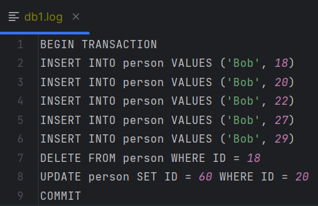
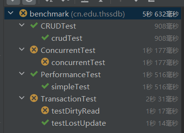

# 22-23春《数据库原理》课程实验——第十一组实验报告

**目录**

- [分工情况](#分工情况)
- [系统设计](#系统设计)
- [测试报告](#测试报告)

---

## 分工情况

- 朴灿彬：元数据模块 & 存储模块
- 辛馨：查询模块
- 王乐民：并发控制模块 & 重启恢复模块

分工严格，各成员负责各自的模块，为其他模块保留相关接口。

---

## 系统设计

### 元数据模块

>负责人：朴灿彬

1. **数据库系统——`Manager`类**

数据库的相关信息——数据库名称由`Manager`类进行管理，存入`/data/manager_meta`文件（可读文本）中。该文件仅在：

- 创建新的数据库
- 删除已有数据库

时发生改变。系统重启恢复时，根据该文件中存储的数据库名称找到各数据库对应的元数据文件以恢复相关信息。而数据库内部信息——表名称、各表结构的管理则交由`Database`类进行。

2. **数据库——`Database`类**

数据库内部相关信息——数据库名称、表名称、表结构由`Database`类进行管理，存入`/data/<DatabaseName>/meta`文件（二进制文件）中。该文件仅在：

- 创建新的表
- 删除已有表

时发生改变。系统重启恢复时，根据该文件中存储的表相关信息恢复各表的管理类——`Table`类。

3. **数据表——`Table`类**

数据表相关信息——表名称、表结构、主键索引B+树、B+树节点缓存管理类 由`Table`类进行管理，存入`/data/<DatabaseName>/<TableName>/meta`文件（二进制文件）中。该文件仅在：

- 插入数据
- 删除数据
- 更新数据

时发生改变。`Table`类对数据的查询、变更均由其**B+树成员变量`index`以及`index`的成员变量`TreeNodeManager`——B+树节点缓存管理类**进行。系统重启恢复时，在恢复`Table`类的同时并恢复该数据表上的索引节点管理类`TreeNodeManager`，并**默认从相关文件中加载根节点至内存，并使其常驻内存**。

>这是由于任何操作都从根节点开始，对根节点的访问频率最高。

---

### 存储模块

>负责人：朴灿彬

1. **数据索引、持久化——`BPlusTree`与`TreeNodeManager`类**

在原有的B+树框架上进行了大量改动，现由`TreeNodeManager`管理节点缓存空间，不再将整颗B+树加载至内存，而对B+树的操作均**以节点为单位**进行——任何对B+树上的操作需要从`TreeNodeManager`中申请节点对象。

B+索引树现对应一个`TreeNodeManager`，而`TreeNodeManager`使用固定大小——`GLOBAL.CACHE_SIZE`的哈希表，在内存中保留根节点以及最近加载、使用的节点。并且用`LinkedHashMap`，使用**LRU缓存管理策略，在缓存为满且由于缓存未命中而需要加载新的节点时将最近最少使用的节点从缓存中删除**。

而`TreeNodeManager`则是根据每个节点的唯一辨识符（`UUID`）对请求的节点进行识别，并找到相关文件以加载的。

>每个节点相应的数据文件路径：`/data/<DatabaseName>/<TableName>/<Node-ID>`

2. **INSERT**

首先，检查即将插入的行中主键是否与原有数据冲突。若冲突，则返回相应的错误信息——`DuplicateKeyException`。

若插入的主键是新的主键，则允许插入：从根节点开始，在当前节点的主键列表中查询新的数据需要插入的位置（或者说，需要向下搜索的子节点）。若需要搜索某个子节点，向`TreeNodeManager`类申请该节点，而若其未在缓存中，则从磁盘中加载。

由父节点调用子节点的插入函数，若子节点**上溢出**，则调用子节点的**分离函数**，将子节点一分为二，维护B+树特性。

3. **DELETE**

首先检查删除目标过滤条件是否在主键上：

- 若是，从根节点开始，搜索主键值与过滤条件相同的数据。若找到则删除目标数据。
- 若不是，则调用数据表迭代器`TableIterator`——其实就是B+树迭代器`BPlusTreeIterator`，遍历所有数据，并将所有符合过滤条件的数据主键保存起来。遍历完所有数据后，根据存起来的主键，一一删除目标数据。

由父节点调用子节点的删除函数，若子节点**下溢出**，则调用子节点的**合并函数**，将子节点与其左右兄弟节点（优先与左兄弟节点）进行合并，维护B+树特性。

4. **UPDATE**

整体上的思想是：**删除原来的行，加入新的行**，实现较为简单，**仅支持主键上的`WHERE`过滤条件**。

特别地，若改变的是主键的值，则先检查当前数据表中是否存在主键值与更新目标在更新后的主键值相同的数据，若有则返回相应的错误信息——`IllegalArgumentException`。

---

### 查询模块

>负责人：辛馨

1. **表查找逻辑——`QueryTable`类的实现**

本项目首先自顶向下地实现了`QueryTable`类，该类的本质是构建一个在查询期间使用的临时表，用于区分及处理单表和多表连接的查询场景。

基于单表查询和多表查询两个场景，本项目将`QueryTable`类重定义为了一个抽象类，并为其实现了`SingleQueryTable`和`MultipleQueryTable`两个子类，分别处理单表查询和多表连接查询。

`QueryTable`抽象类的几个核心函数如下：

```java
  public abstract void findAndAddNext(); // 找到下一个符合查询条件的行，并将其添加至当前的临时查询表

  public abstract ArrayList<MetaInfo> GenerateMetaInfo();  // 生成当前查询表的表名和列信息两类元数据

  @Override
  public boolean hasNext() {  // 判断当前查询表是否已读完
    if (!row_queue.isEmpty() || first_flag) return true;
    return false;
  }

  // return next row
  @Override
  public QueryRow next() {  // 返回当前查询表的下一行
    if (row_queue.isEmpty()) {
      findAndAddNext();
      System.out.println("QueryTable next(): row_queue.isEmpty() -> findAndAddNext done");
      if (first_flag) first_flag = false;
    }

    QueryRow res_row = null;
    if (!row_queue.isEmpty()) res_row = row_queue.poll();
    else return null;
    if (row_queue.isEmpty()) findAndAddNext();

    System.out.println("QueryTable next(): !row_queue.isEmpty() -> findAndAddNext done");

    return res_row;
  }
```

基于`QueryTable`类的方法定义，`SingleQueryTable`和`MultipleQueryTable`两个子类分别对`QueryTable`的两个抽象方法进行了具体的实现。总体而言，`SingleQueryTable`是直接对要查询的单表展开查询搜索，并将符合的行加入到当前的临时查询表当中；而`MultipleQueryTable`则是先基于限定条件将要查询的多个表连接成一个单个查询表，然后再返回查询答案。

为了实现`MultipleQueryTable`类，我们还实现了一个`QueryRow`类，用于将原本位于多个表中的行数据连接成一个能加入临时查询表的单行。

2. **WHERE语句的执行——`MultipleCondition`、`Condition`、`Expression`类的实现**

官方文件SQL.g4的SELECT语句结构如下：

```SQL
selectStmt :
    K_SELECT ( K_DISTINCT | K_ALL )? resultColumn ( ',' resultColumn )*
        K_FROM tableQuery ( ',' tableQuery )* ( K_WHERE multipleCondition )? ;
```

更进一步地，其将multipleCondition递归定义如下：

```SQL
multipleCondition :
    condition
    | multipleCondition AND multipleCondition
    | multipleCondition OR multipleCondition ;
```

```SQL
condition :
    expression comparator expression;
```

```SQL
expression :
    comparer
    | expression ( MUL | DIV ) expression
    | expression ( ADD | SUB ) expression
    | '(' expression ')';
```

```SQL
comparer :
    columnFullName
    | literalValue ;
```

基于SQL.g4的对WHERE模块的递归定义，我们实现了对应的三个嵌套类`multipleCondition`、`Condition`和`Expression`。

完成WHERE查询时，我们递归调用三个类各自的`executeQuery`方法，通过该方法的层层执行与传递获取整个查询语句WHERE模块的查询结果。

>（本项目的Expression类并未实现SQL.g4中带中间运算符的完整逻辑，而只是完成了基础功能的要求，即expression的实现等同于comparer的实现）

---

### 并发 & 事务模块

>负责人：王乐民

1. **事务模块** `Main Transaction`类

主要包含了四个主要函数：`beginTransaction` `commitTransaction` `writeTransaction` `readTransaction`

通过执行函数`exec`将`plan`划分成：`CommitPlan` `BeginTransactionPlan` `InsertPlan`  `DeletePlan` `UpdatePlan` `SelectPlan`  

`checkTransaction`是一个布尔变量查看当前是否有事务正在执行

- `beginTransaction`：对应于`BeginTransactionPlan`语句。功能表示事务的开始，若当前已有事务进行，则报错；

- `commitTransaction`：对应于`CommitPlan`语句。功能表示事务的结束，若当前隔离级别为读已提交`read committed`将其释放锁；

- `writeTransaction`：对应于`InsertPlan`  `DeletePlan` `UpdatePlan`语句。过程需要加上写锁，并执行相应的`plan`；

- `readTransaction`：对应于``SelectPlan` 语句。过程需要加上写锁，并执行相应的plan。

2. **并发模块**

SQL标准定义了四种隔离级别：`Read Uncommitted` `Read Committed` `Repeatable Read` `Serializable`

从上往下，隔离强度逐渐增强，性能逐渐变差。事务隔离其实就是为了解决脏读、不可重复读、幻读的问题：

| 隔离级别         | 丢失更新 | 脏读 | 不可重复读 | 幻读 |
| ---------------- | -------- | ---- | ---------- | ---- |
| Read Uncommitted | X        | O    | O          | O    |
| Read Committed   | X        | X    | O          | O    |
| Serializable     | X        | X    | X          | X    |
     
实现方式：
     
`Read Uncommitted`：事务在对表执行写操作之前需获取其写锁（writeLock），事务完毕后才释放。
     
`Read Committed`：
     
- 事务在对表执行写操作之前需获取其写锁（writeLock），事务完毕后才释放；
     
- 事务在对表执行读操作之前需获取其读锁（readLock），事务完毕后即可释放。
     
`Serializable`：
     
- 事务在对表执行写操作之前需获取其写锁（writeLock），事务完毕后才释放；
     
- 事务在对表执行读操作之前需获取其读锁（readLock），事务完毕后才释放。
     
操作函数：
     
```java
      private ReentrantReadWriteLock.ReadLock getReadLock(String tableName) {
         if (!readLocks.containsKey(tableName)) {
           Table table = manager.getCurDB().getTable(tableName);
           ReentrantReadWriteLock lock = table.getLock();
           readLocks.put(tableName, lock.readLock());
         }
         return readLocks.get(tableName);
       }
     
       private ReentrantReadWriteLock.WriteLock getWriteLock(String tableName) {
         if (!writeLocks.containsKey(tableName)) {
           Table table = manager.getCurDB().getTable(tableName);
           ReentrantReadWriteLock lock = table.getLock();
           writeLocks.put(tableName, lock.writeLock());
         }
         return writeLocks.get(tableName);
       }
     
       private void releaseAllLocks() {
         for (ReentrantReadWriteLock.ReadLock readLock : readLocks.values()) {
           readLock.unlock();
         }
         for (ReentrantReadWriteLock.WriteLock writeLock : writeLocks.values()) {
           writeLock.unlock();
         }
         readLocks.clear();
         writeLocks.clear();
       }
     }
```

---

### 重启恢复模块

>负责人：王乐民

`WAL`机制：预写式日志是关系数据库系统中用于提供原子性和持久性（`ACID` 属性中的两个）的一系列技术。在使用 `WAL` 的系统中，所有的修改在提交之前都要先写入` log` 文件中。

在构造数据库函数定义好创建log文件的代码逻辑，并通过`writeLines`函数将用户输入的指令存到log文件中。再重启数据库，调用`recover`函数来执行`log`的读取和恢复。

操作函数：`Logger`类

```java
       public Logger(String folder_name, String file_name) {
         this.folder_name = folder_name;
         this.file_name = file_name;
         this.full_path = Paths.get(folder_name, file_name).toString();
     
         File d = new File(this.folder_name);
         if (!d.isDirectory()) {
           System.out.println("Make Logfile");
           d.mkdirs();
         }
         File f = new File(this.full_path);
         if (!f.isFile()) {
           try {
             f.createNewFile();
           } catch (IOException e) {
             throw new CustomIOException();
           }
         }
       }
     
       public ArrayList<String> readLog() {
         System.out.println("readLog");
     
         ArrayList<String> lines = new ArrayList<>();
         String str;
         try {
           BufferedReader reader = new BufferedReader(new FileReader(full_path));
           while ((str = reader.readLine()) != null) {
             lines.add(str);
           }
           reader.close();
         } catch (IOException e) {
           throw new CustomIOException();
         }
         return lines;
       }
       
       public void writeLines(List<String> lines) {
         System.out.println("writeLog");
         try {
           BufferedWriter writer = new BufferedWriter(new FileWriter(full_path, true));
           for (String line : lines) {
             writer.write(line);
             writer.newLine();
           }
           writer.close();
         } catch (IOException e) {
           throw new CustomIOException();
         }
       }
```

  


---


## 测试报告

在`serializable`以及`read-committed`隔离级别下均可通过以下测试：

  

由于**并发模块**未能完整实现，并发与事务相关模式均无法通过测试。