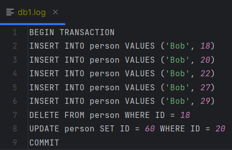

# 22-23春《数据库原理》课程实验——设计文档

### 并发 & 事务模块

1. **事务模块** `Main Transaction`类

主要包含了四个主要函数：`beginTransaction` `commitTransaction` `writeTransaction` `readTransaction`

通过执行函数`exec`将`plan`划分成：`CommitPlan` `BeginTransactionPlan` `InsertPlan`  `DeletePlan` `UpdatePlan` `SelectPlan`  

`checkTransaction`是一个布尔变量查看当前是否有事务正在执行

- `beginTransaction`：对应于`BeginTransactionPlan`语句。功能表示事务的开始，若当前已有事务进行，则报错；

- `commitTransaction`：对应于`CommitPlan`语句。功能表示事务的结束，若当前隔离级别为读已提交`read committed`将其释放锁；

- `writeTransaction`：对应于`InsertPlan`  `DeletePlan` `UpdatePlan`语句。过程需要加上写锁，并执行相应的`plan`；

- `readTransaction`：对应于``SelectPlan` 语句。过程需要加上写锁，并执行相应的plan。

2. **并发模块**

     SQL标准定义了四种隔离级别：`Read Uncommitted` `Read Committed` `Repeatable Read` `Serializable`

     从上往下，隔离强度逐渐增强，性能逐渐变差。事务隔离其实就是为了解决脏读、不可重复读、幻读的问题：

     | 隔离级别         | 丢失更新 | 脏读 | 不可重复读 | 幻读 |
     | ---------------- | -------- | ---- | ---------- | ---- |
     | Read Uncommitted | X        | O    | O          | O    |
     | Read Committed   | X        | X    | O          | O    |
     | Serializable     | X        | X    | X          | X    |
     
     实现方式：
     
     `Read Uncommitted`：事务在对表执行写操作之前需获取其写锁（writeLock），事务完毕后才释放。
     
     `Read Committed`：
     
     - 事务在对表执行写操作之前需获取其写锁（writeLock），事务完毕后才释放；
     
     - 事务在对表执行读操作之前需获取其读锁（readLock），事务完毕后即可释放。
     
     `Serializable`：
     
     - 事务在对表执行写操作之前需获取其写锁（writeLock），事务完毕后才释放；
     
     - 事务在对表执行读操作之前需获取其读锁（readLock），事务完毕后才释放。
     
     操作函数：
     
     ```java
      private ReentrantReadWriteLock.ReadLock getReadLock(String tableName) {
         if (!readLocks.containsKey(tableName)) {
           Table table = manager.getCurDB().getTable(tableName);
           ReentrantReadWriteLock lock = table.getLock();
           readLocks.put(tableName, lock.readLock());
         }
         return readLocks.get(tableName);
       }
     
       private ReentrantReadWriteLock.WriteLock getWriteLock(String tableName) {
         if (!writeLocks.containsKey(tableName)) {
           Table table = manager.getCurDB().getTable(tableName);
           ReentrantReadWriteLock lock = table.getLock();
           writeLocks.put(tableName, lock.writeLock());
         }
         return writeLocks.get(tableName);
       }
     
       private void releaseAllLocks() {
         for (ReentrantReadWriteLock.ReadLock readLock : readLocks.values()) {
           readLock.unlock();
         }
         for (ReentrantReadWriteLock.WriteLock writeLock : writeLocks.values()) {
           writeLock.unlock();
         }
         readLocks.clear();
         writeLocks.clear();
       }
     }
     ```
     
     
     
     ### 重启恢复模块
     
     `WAL`机制：预写式日志是关系数据库系统中用于提供原子性和持久性（`ACID` 属性中的两个）的一系列技术。在使用 `WAL` 的系统中，所有的修改在提交之前都要先写入` log` 文件中。
     
     在构造数据库函数定义好创建log文件的代码逻辑，并通过`writeLines`函数将用户输入的指令存到log文件中。再重启数据库，调用`recover`函数来执行`log`的读取和恢复。
     
     操作函数：`Logger`类
     
     ```java
       public Logger(String folder_name, String file_name) {
         this.folder_name = folder_name;
         this.file_name = file_name;
         this.full_path = Paths.get(folder_name, file_name).toString();
     
         File d = new File(this.folder_name);
         if (!d.isDirectory()) {
           System.out.println("Make Logfile");
           d.mkdirs();
         }
         File f = new File(this.full_path);
         if (!f.isFile()) {
           try {
             f.createNewFile();
           } catch (IOException e) {
             throw new CustomIOException();
           }
         }
       }
     
       public ArrayList<String> readLog() {
         System.out.println("readLog");
     
         ArrayList<String> lines = new ArrayList<>();
         String str;
         try {
           BufferedReader reader = new BufferedReader(new FileReader(full_path));
           while ((str = reader.readLine()) != null) {
             lines.add(str);
           }
           reader.close();
         } catch (IOException e) {
           throw new CustomIOException();
         }
         return lines;
       }
       
       public void writeLines(List<String> lines) {
         System.out.println("writeLog");
         try {
           BufferedWriter writer = new BufferedWriter(new FileWriter(full_path, true));
           for (String line : lines) {
             writer.write(line);
             writer.newLine();
           }
           writer.close();
         } catch (IOException e) {
           throw new CustomIOException();
         }
       }
     ```
     
     
     
     
     
     


